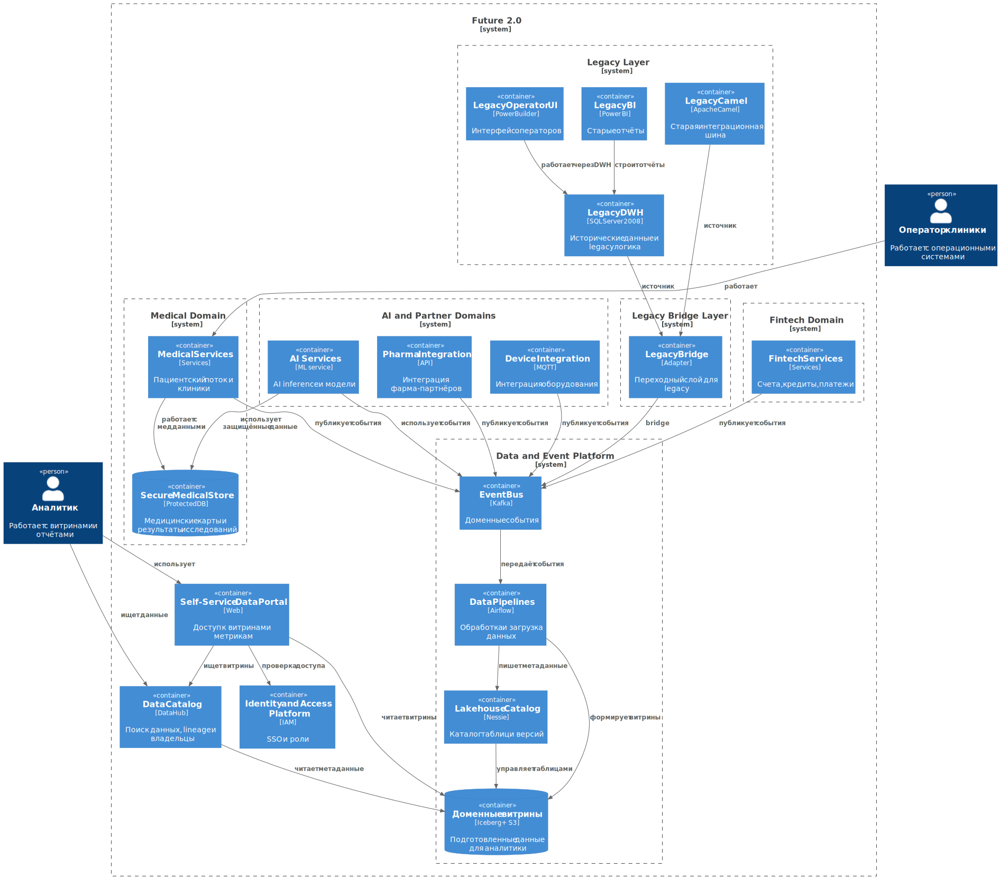
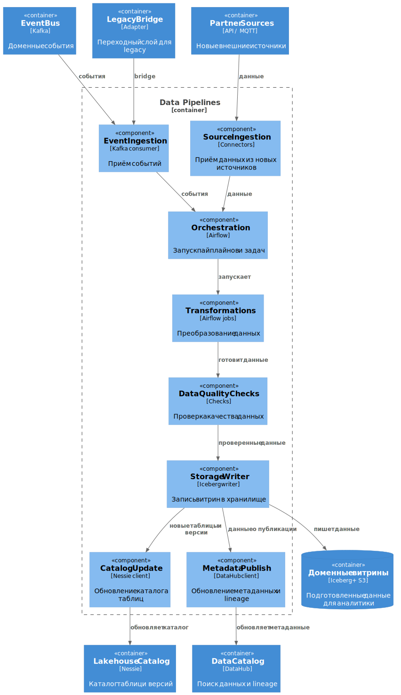

# 3. Целевая архитектура и риски трансформации

## C4 Container

## C4 Component

## Декомпозиция Legacy ESB

Apache Camel рассматривается как legacy ESB (Enterprise Service Bus) и временный слой совместимости для старых систем. Целевая событийная шина отвечает за доставку доменных событий, и прежние функции ESB разъезжаются по специализированным компонентам:
- ФЛК и проверка контрактов входящих сообщений: API Gateway и Schema Registry;
- трансформации и ETL: пайплайны данных под управлением Airflow;
- маршрутизация доменных событий: Kafka как Event Bus;
- бизнес-логика: доменные сервисы Medical, Fintech, AI/Partner;
- legacy-интеграции: Legacy Bridge как временный слой совместимости и ACL.

## Карта рисков

### 1. Архитектурные риски

| № | Риск | Вероятность | Влияние |
|---|---|---|---|
| 1.1 | Затяжная зависимость от DWH и Camel в критических потоках | Высокая | Высокое |
| 1.2 | Рост числа точечных интеграций между доменами | Высокая | Высокое |
| 1.3 | Задержка подключения новых бизнес-направлений и регионов | Средняя | Высокое |

### 2. Технологические риски

| № | Риск | Вероятность | Влияние |
|---|---|---|---|
| 2.1 | Нарушение требований по защите медицинских и финансовых данных | Средняя | Высокое |
| 2.2 | Несогласованность схем событий между доменами | Высокая | Среднее |
| 2.3 | Низкое качество данных при миграции из legacy | Высокая | Высокое |
| 2.4 | Сбой потоковой платформы на критичных бизнес-процессах | Средняя | Высокое |
| 2.5 | Недостаточная наблюдаемость и трассировка событий | Средняя | Среднее |

### 3. Организационные риски

| № | Риск | Вероятность | Влияние |
|---|---|---|---|
| 3.1 | Сопротивление доменных команд смене модели работы | Высокая | Среднее |
| 3.2 | Конфликт зон ответственности между платформенной и доменными командами | Средняя | Среднее |
| 3.3 | Нехватка экспертизы по event-driven и data platform | Высокая | Высокое |
| 3.4 | Перерасход бюджета из-за параллельной поддержки legacy и новой платформы | Средняя | Высокое |

## План управления рисками

### 1. Архитектурные риски

#### 1.1. Затяжная зависимость от DWH и Camel в критических потоках

Меры:
- поэтапно выводить legacy из критического контура.

Подход: технический + управленческий.

#### 1.2. Рост числа точечных интеграций между доменами

Меры:
- разрешить новые интеграции только через события и доменные API;
- зафиксировать это правило в архитектурных решениях;
- проверять новые интеграции на архитектурном ревью.

Подход: технический + управленческий.

#### 1.3. Задержка подключения новых бизнес-направлений и регионов

Меры:
- подготовить типовой путь подключения новых доменов;
- использовать стандартные шаблоны интеграции;
- заранее определить обязательные требования по безопасности и данным.

Подход: технический + управленческий.

### 2. Технологические риски

#### 2.1. Нарушение требований по защите медицинских и финансовых данных

Меры:
- разделить контуры доступа;
- использовать шифрование, роли и аудит доступа;
- ограничить доступ к чувствительным данным по принципу deny by default.

Подход: технический.

#### 2.2. Несогласованность схем событий между доменами

Меры:
- вести единый каталог схем событий;
- использовать версионирование контрактов;
- проверять совместимость схем в CI/CD.

Подход: технический.

#### 2.3. Низкое качество данных при миграции из legacy

Меры:
- добавить проверки качества данных;
- выполнять миграцию поэтапно;
- сверять старые и новые витрины на переходном периоде.

Подход: технический.

#### 2.4. Сбой потоковой платформы на критичных бизнес-процессах

Меры:
- настроить отказоустойчивую платформу с DLQ, retry и резервированием.

Подход: технический.

#### 2.5. Недостаточная наблюдаемость и трассировка событий

Меры:
- ввести централизованные логи и метрики;
- настроить трассировку и алерты;
- использовать единые correlation id для API и событий.

Подход: технический.

### 3. Организационные риски

#### 3.1. Сопротивление доменных команд смене модели работы

Меры:
- провести пилоты с обучением и назначением ответственных.

Подход: управленческий.

#### 3.2. Конфликт зон ответственности между платформенной и доменными командами

Меры:
- зафиксировать роли;
- определить ownership и правила эскалации;
- договориться о границах ответственности платформенной команды.

Подход: управленческий.

#### 3.3. Нехватка экспертизы по event-driven и data platform

Меры:
- нанять специалистов;
- провести обучение;
- использовать готовые шаблоны решений и типовые практики.

Подход: управленческий.

#### 3.4. Перерасход бюджета из-за параллельной поддержки legacy и новой платформы

Меры:
- внедрять поэтапно;
- ограничивать срок жизни временных решений;
- регулярно пересматривать стоимость платформы и legacy.

Подход: управленческий.
