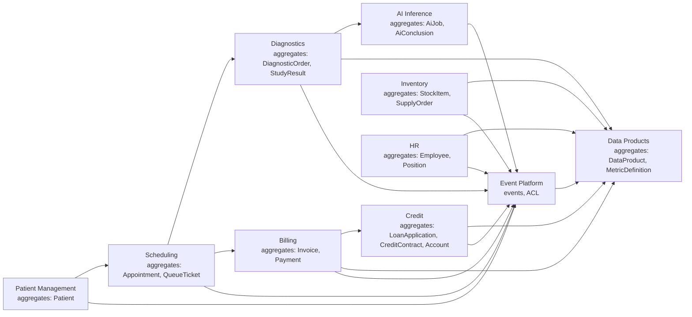

# Bounded Contexts

```mermaid
flowchart LR
    Patients["Patient Management
    aggregates: Patient"]
    Scheduling["Scheduling
    aggregates: Appointment, QueueTicket"]
    Diagnostics["Diagnostics
    aggregates: DiagnosticOrder, StudyResult"]
    AiDomain["AI Inference
    aggregates: AiJob, AiConclusion"]
    Billing["Billing
    aggregates: Invoice, Payment"]
    Credit["Credit
    aggregates: LoanApplication, CreditContract, Account"]
    Inventory["Inventory
    aggregates: StockItem, SupplyOrder"]
    Hr["HR
    aggregates: Employee, Position"]
    Analytics["Data Products
    aggregates: DataProduct, MetricDefinition"]
    Integration["Event Platform
    events, ACL"]

    Patients --> Scheduling
    Scheduling --> Diagnostics
    Diagnostics --> AiDomain
    Scheduling --> Billing
    Billing --> Credit
    Diagnostics --> Analytics
    Billing --> Analytics
    Credit --> Analytics
    Inventory --> Analytics
    Hr --> Analytics

    Patients --> Integration
    Scheduling --> Integration
    Diagnostics --> Integration
    AiDomain --> Integration
    Billing --> Integration
    Credit --> Integration
    Inventory --> Integration
    Hr --> Integration
    Integration --> Analytics
```
