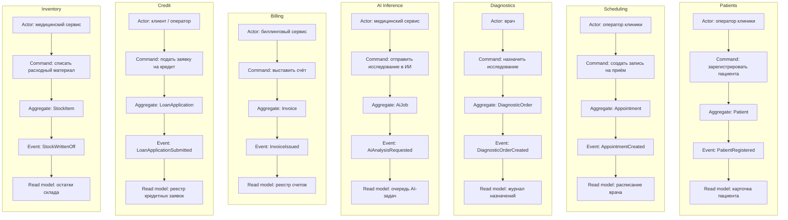
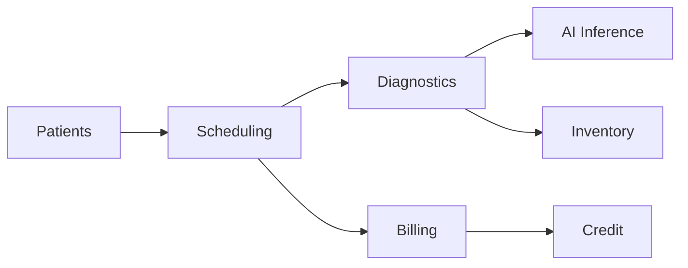

# Event Storming

```mermaid
flowchart TB
    subgraph Patients
        direction TB
        PA["Actor: оператор клиники"] --> PC["Command: зарегистрировать пациента"]
        PC --> PG["Aggregate: Patient"]
        PG --> PE["Event: PatientRegistered"]
        PE --> PR["Read model: карточка пациента"]
    end

    subgraph Scheduling
        direction TB
        SA["Actor: оператор клиники"] --> SC["Command: создать запись на приём"]
        SC --> SG["Aggregate: Appointment"]
        SG --> SE["Event: AppointmentCreated"]
        SE --> SR["Read model: расписание врача"]
    end

    subgraph Diagnostics
        direction TB
        DA["Actor: врач"] --> DC["Command: назначить исследование"]
        DC --> DG["Aggregate: DiagnosticOrder"]
        DG --> DE["Event: DiagnosticOrderCreated"]
        DE --> DR["Read model: журнал назначений"]
    end

    subgraph AI Inference
        direction TB
        AA["Actor: медицинский сервис"] --> AC["Command: отправить исследование в ИИ"]
        AC --> AG["Aggregate: AiJob"]
        AG --> AE["Event: AiAnalysisRequested"]
        AE --> AR["Read model: очередь AI-задач"]
    end

    subgraph Billing
        direction TB
        BA["Actor: биллинговый сервис"] --> BC["Command: выставить счёт"]
        BC --> BG["Aggregate: Invoice"]
        BG --> BE["Event: InvoiceIssued"]
        BE --> BR["Read model: реестр счетов"]
    end

    subgraph Credit
        direction TB
        CA["Actor: клиент / оператор"] --> CC["Command: подать заявку на кредит"]
        CC --> CG["Aggregate: LoanApplication"]
        CG --> CE["Event: LoanApplicationSubmitted"]
        CE --> CR["Read model: реестр кредитных заявок"]
    end

    subgraph Inventory
        direction TB
        IA["Actor: медицинский сервис"] --> IC["Command: списать расходный материал"]
        IC --> IG["Aggregate: StockItem"]
        IG --> IE["Event: StockWrittenOff"]
        IE --> IR["Read model: остатки склада"]
    end
```

## Связи между контекстами

```mermaid
flowchart LR
    Patients["Patients"] --> Scheduling["Scheduling"]
    Scheduling --> Diagnostics["Diagnostics"]
    Diagnostics --> AiInference["AI Inference"]
    Scheduling --> Billing["Billing"]
    Billing --> Credit["Credit"]
    Diagnostics --> Inventory["Inventory"]
```
