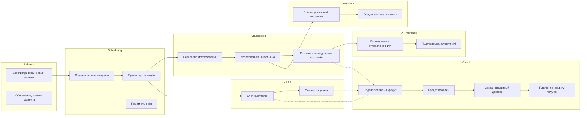

# Event Storming

```mermaid
flowchart LR
    subgraph Patients
        E1["Зарегистрирован новый пациент"]
        E2["Обновлены данные пациента"]
    end

    subgraph Scheduling
        E3["Создана запись на приём"]
        E4["Приём подтверждён"]
        E5["Приём отменён"]
    end

    subgraph Diagnostics
        E6["Назначено исследование"]
        E7["Исследование выполнено"]
        E8["Результат исследования сохранён"]
    end

    subgraph AI Inference
        E9["Исследование отправлено в ИИ"]
        E10["Получено заключение ИИ"]
    end

    subgraph Billing
        E11["Счёт выставлен"]
        E12["Оплата получена"]
    end

    subgraph Credit
        E13["Подана заявка на кредит"]
        E14["Кредит одобрен"]
        E15["Создан кредитный договор"]
        E16["Платёж по кредиту получен"]
    end

    subgraph Inventory
        E17["Списан расходный материал"]
        E18["Создан заказ на поставку"]
    end

    E1 --> E3
    E3 --> E4
    E4 --> E6
    E6 --> E7
    E7 --> E8
    E8 --> E9
    E9 --> E10
    E4 --> E11
    E11 --> E12
    E13 --> E14
    E14 --> E15
    E15 --> E16
    E7 --> E17
    E17 --> E18
    E11 -.-> E13
    E12 -.-> E13
    E8 -.-> E13
```
